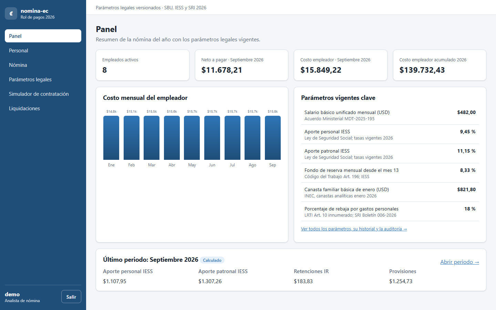
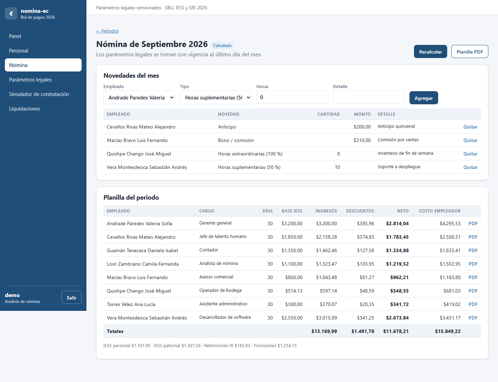
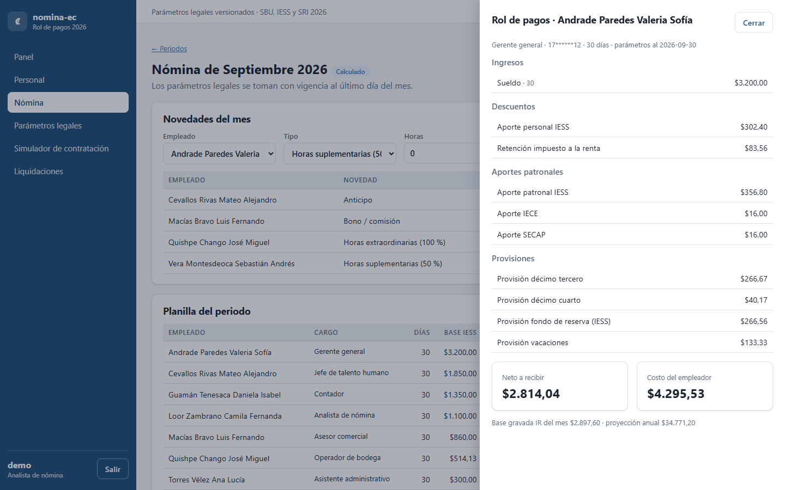
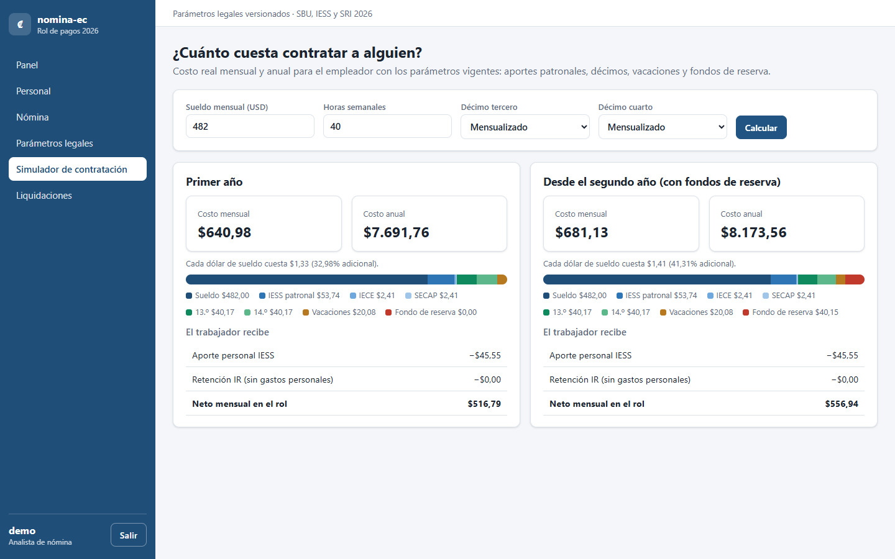
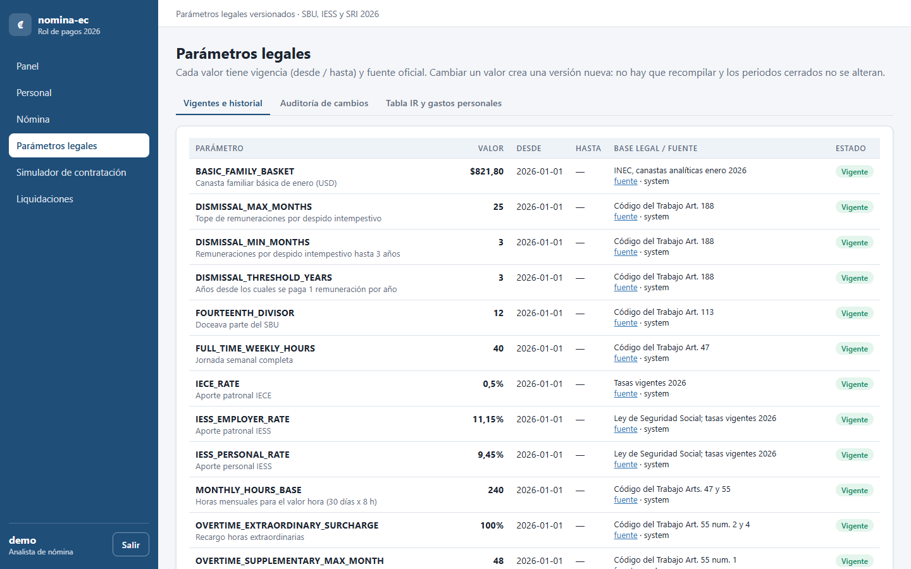
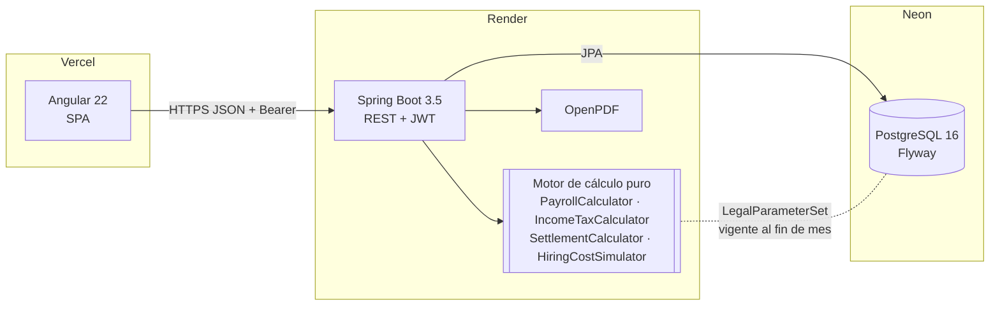
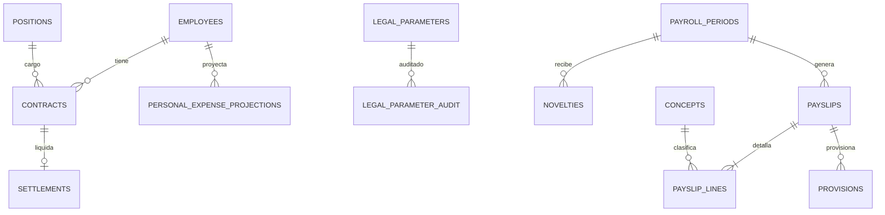

# nomina-ec

Rol de pagos mensual para empresas ecuatorianas con los beneficios de ley de 2026 (IESS, décimos, fondos de reserva, vacaciones, impuesto a la renta) y **parámetros legales versionados por fecha**: cuando cambia el SBU o una tasa, se registra una nueva vigencia y el sistema la aplica sin recompilar, sin tocar los periodos ya cerrados y dejando auditoría.

[](https://github.com/DiegoFranciscoG/nomina-ec/actions/workflows/ci.yml)


**Demo:** _pendiente de publicar (Vercel + Render + Neon)_ · **Usuario de prueba:** `demo` / `Demo-Nomina-2026` (rol analista de nómina: no puede cambiar parámetros legales ni cerrar periodos)



| Planilla del periodo | Rol de pagos | Simulador de contratación | Parámetros versionados |
|---|---|---|---|
|  |  |  |  |

## Problema que resuelve

En Ecuador el rol de pagos depende de valores que cambian cada año (SBU, tabla del impuesto a la renta, canasta básica para gastos personales) y de reglas del Código del Trabajo, el IESS y el SRI. Las hojas de cálculo y muchos sistemas pequeños tienen esos valores "quemados": cada reforma obliga a editar fórmulas o recompilar, y recalcular un mes pasado da resultados distintos. nomina-ec guarda cada valor legal con su vigencia y su fuente, calcula con el valor vigente al fin de cada periodo y congela los periodos cerrados.

## Funcionalidades

- **Cálculo mensual**: sueldo proporcional a días trabajados, horas suplementarias (50 %) y extraordinarias (100 %), faltas, bonos, anticipos, aporte personal y patronal IESS, IECE y SECAP.
- **Impuesto a la renta mensual proyectado** con la tabla 2026 del SRI y la rebaja por gastos personales (18 %, límite en canastas según cargas familiares o enfermedad catastrófica); se reliquida mes a mes con lo ya retenido.
- **Provisiones** de décimo tercero, décimo cuarto (Costa/Galápagos o Sierra/Amazonía), fondos de reserva desde el día 366 y vacaciones.
- **Décimos y fondos de reserva acumulados o mensualizados** por empleado, con saldo anual.
- **Rol individual en PDF, planilla del periodo en PDF** y liquidación básica (desahucio Art. 185, despido intempestivo Art. 188, vacaciones y décimos proporcionales).
- **Parámetros legales versionados** (`valor`, `vigente_desde`, `vigente_hasta`, `fuente_url`) con **auditoría** de cada cambio: quién, cuándo, antes, después y motivo.
- **Simulador "¿cuánto cuesta contratar a alguien?"**: costo mensual y anual del primer año y desde el segundo (con fondos de reserva), y lo que recibe el trabajador.
- **Roles reproducibles**: cada rol guarda el snapshot de parámetros usados; los periodos cerrados son inmutables.

## Arquitectura



Capas del backend: `controller` → `service` → `repository`, con `dto`, `mapper`, `exception`, `security`, `config` y un paquete `calculation` **sin dependencias de Spring**: recibe un `LegalParameterSet` inmutable y devuelve montos redondeados con `BigDecimal` y `HALF_UP`.

## Stack y por qué

| Capa | Tecnología | Motivo |
|---|---|---|
| Backend | Java 21, Spring Boot 3.5.16, Spring Security, JPA/Hibernate | Stack pedido; records para DTO, `BigDecimal` para dinero, ecosistema maduro para seguridad |
| Cálculo | Java puro + `BigDecimal` HALF_UP | Funciones deterministas, fáciles de probar a mano y reutilizadas por el simulador |
| Base de datos | PostgreSQL 16 + Flyway | `EXCLUDE USING gist` impide vigencias superpuestas; JSONB para snapshots y auditoría |
| PDF | OpenPDF 3.0.5 | Librería libre (LGPL/MPL) sin servicios externos |
| Frontend | Angular 22 (standalone, signals, zoneless) | Stack pedido; carga diferida por página, 78 kB iniciales comprimidos |
| Pruebas | JUnit 5, AssertJ, Testcontainers, JaCoCo, Vitest | Casos numéricos verificados a mano + integración contra PostgreSQL real |
| DevOps | Docker multi-stage, Docker Compose, GitHub Actions, gitleaks, Dependabot | Un comando para levantar todo; CI con escaneo de secretos |

## Modelo de datos

Detalle de tablas, restricciones y fuentes en [docs/modelo-datos.md](docs/modelo-datos.md) (derivado de [docs/investigacion.md](docs/investigacion.md)).



## Cómo ejecutar en local

**Con Docker** (PostgreSQL + API + web con datos ficticios de demostración):

```bash
cp .env.example .env          # completa DB_PASSWORD, JWT_SECRET (>= 32 caracteres), ADMIN_PASSWORD y DEMO_PASSWORD
docker compose up --build
```

- Web: http://localhost:4200 · API: http://localhost:8080 · Swagger: http://localhost:8080/swagger-ui.html

**Sin Docker** (requiere Java 21, Node 22 y un PostgreSQL 16 accesible):

```bash
cd backend
export DB_URL=jdbc:postgresql://localhost:5432/nomina DB_USER=... DB_PASSWORD=... JWT_SECRET=... ADMIN_PASSWORD=... CORS_ALLOWED_ORIGINS=http://localhost:4200
./mvnw spring-boot:run

cd ../web
npm ci && npm start            # http://localhost:4200 (usa public/config.json -> http://localhost:8080)
```

## Variables de entorno

| Variable | Descripción | Obligatoria |
|---|---|---|
| `DB_URL` | JDBC de PostgreSQL (Neon en producción, con `?sslmode=require`) | Sí |
| `DB_USER` / `DB_PASSWORD` | Credenciales de la base | Sí |
| `JWT_SECRET` | Secreto HS256, mínimo 32 caracteres aleatorios | Sí |
| `JWT_EXPIRATION_MINUTES` | Duración del token (por defecto 30) | No |
| `CORS_ALLOWED_ORIGINS` | Orígenes permitidos separados por coma (sin `*`) | Sí |
| `ADMIN_USERNAME` / `ADMIN_PASSWORD` | Usuario administrador creado en el primer arranque (contraseña >= 12) | Sí (contraseña) |
| `DEMO_USERNAME` / `DEMO_PASSWORD` | Usuario de demostración con rol PAYROLL | No |
| `DEMO_DATA` | `true` carga empleados y periodos ficticios del año en curso | No |
| `COMPANY_NAME` | Razón social que aparece en los PDF | No |
| `API_URL` | (Vercel) URL https de la API que se escribe en `config.json` | Sí en Vercel |

Si falta una variable obligatoria la aplicación **no arranca** (no hay valores por defecto para secretos).

## API

Swagger UI: `http://localhost:8080/swagger-ui.html` · colección de ejemplos: [docs/api.http](docs/api.http)

| Método | Ruta | Descripción | Rol |
|---|---|---|---|
| POST | `/api/auth/login` | JWT (limitado por IP) | público |
| GET/POST | `/api/employees` | Personal y contrato | POST: ADMIN, PAYROLL |
| PUT | `/api/employees/{id}/contract` | Sueldo, jornada, décimos acumulados/mensualizados | ADMIN, PAYROLL |
| PUT | `/api/employees/{id}/personal-expenses` | Proyección de gastos personales del año | ADMIN, PAYROLL |
| GET | `/api/employees/{id}/benefits?year=` | Saldo de décimos y fondos de reserva | autenticado |
| POST | `/api/periods` · `/api/periods/{id}/novelties` | Periodo y novedades | ADMIN, PAYROLL |
| POST | `/api/periods/{id}/calculate` | Calcula o recalcula los roles | ADMIN, PAYROLL |
| POST | `/api/periods/{id}/close` | Cierra el periodo (inmutable) | ADMIN |
| GET | `/api/periods/{id}/payroll` · `/payroll.pdf` | Planilla con totales | autenticado |
| GET | `/api/payslips/{id}` · `/pdf` | Rol individual | autenticado |
| GET/POST | `/api/legal-parameters` | Versiones con vigencia y fuente / nueva versión | POST: ADMIN |
| GET | `/api/legal-parameters/audit` | Auditoría de cambios | autenticado |
| GET | `/api/legal-parameters/tax-tables/{year}` | Tabla IR y límites de gastos personales | autenticado |
| POST | `/api/simulations/hiring-cost` | Simulador de costo de contratación | autenticado |
| POST | `/api/settlements/preview` · `/preview.pdf` · `/api/settlements` | Liquidación (vista previa / registro) | registro: ADMIN |

## Tests y cobertura

```bash
cd backend && ./mvnw verify    # 43 unitarios + 23 de integración (Testcontainers, requiere Docker) + JaCoCo
cd web && npx ng test --watch=false                      # Vitest
cd web && E2E_PASSWORD=<contraseña demo> npm run e2e     # Playwright contra docker compose (flujo crítico)
```

En CI el job `e2e` levanta el stack con `docker compose up --build --wait` usando secretos efímeros generados en el propio job y ejecuta Playwright con Chromium.

| Paquete | Líneas cubiertas |
|---|---|
| `calculation` (motor) | 98 % |
| `service` | 79 % |
| Total backend | 88 % |

El build falla si `calculation` o `service` bajan de 70 %. Los casos de prueba del motor tienen la aritmética escrita en comentarios para verificarlos con una calculadora; por ejemplo, sueldo 1 200 con 10 h al 50 % y 4 h al 100 %: valor hora 5,00 → 75,00 + 40,00; base IESS 1 315,00; aporte personal 124,27; neto 1 300,27; costo del empleador 1 788,86.

## Despliegue (gratis)

| Servicio | Qué corre | Límites del plan gratuito (verificados sep-2026) |
|---|---|---|
| [Neon](https://neon.com/pricing) | PostgreSQL 16 | 0,5 GB y 100 CU-h por proyecto |
| [Render](https://render.com/docs/free) | API (Docker, `render.yaml`) | Duerme tras 15 min sin tráfico (primer request ~1 min); 750 h/mes |
| [Vercel](https://vercel.com) | Web Angular (`web/vercel.json`) | Hobby gratuito |

Pasos: 1) crear proyecto en Neon y copiar la cadena JDBC; 2) en Render, *New → Blueprint* con este repo y completar las variables marcadas `sync: false`; 3) en Vercel, importar el repo con *Root Directory* `web` y variable `API_URL` = URL de Render; 4) poner la URL de Vercel en `CORS_ALLOWED_ORIGINS` de Render.

## Seguridad aplicada

- Secretos solo por variables de entorno; la app no arranca si faltan. `.env` ignorado; gitleaks en pre-commit y en CI.
- Spring Security **deny-by-default** (`anyRequest().authenticated()`); solo login, health y OpenAPI son públicos. Roles ADMIN / PAYROLL / VIEWER con `@PreAuthorize`.
- JWT HS256 con secreto >= 256 bits y expiración de 30 min; sin cookies (no hay superficie CSRF).
- BCrypt (coste 12); login con **rate limiting** por IP y tiempo constante para usuario inexistente (evita enumeración).
- CORS con orígenes explícitos desde variables de entorno; cabeceras CSP, X-Frame-Options DENY, HSTS, Referrer-Policy.
- Bean Validation en todos los DTO (cédula con dígito verificador, rangos de horas, montos); manejador global RFC 9457 sin stack traces ni SQL.
- SQL solo mediante JPA/JPQL parametrizado; `ddl-auto: validate` y esquema versionado con Flyway.
- Actuator expone solo `health`. Docker multi-stage, imágenes con versión fija, usuario no root y healthcheck.
- LOPDP: datos de demostración ficticios; la cédula se devuelve enmascarada (`17******10`).

## Decisiones técnicas

- **Parámetros como datos con vigencia, no como constantes** → descartado `application.yml` o enums con valores: exigen redeploy y no permiten recalcular meses anteriores con el valor de su época. Una restricción `EXCLUDE USING gist` garantiza un único valor por fecha.
- **Motor de cálculo puro** (sin Spring ni base de datos) → se prueba con casos a mano en milisegundos y el simulador reutiliza exactamente el mismo cálculo que el rol real.
- **Snapshot JSONB de parámetros en cada rol** → auditoría y reproducibilidad aunque luego cambie la tabla de parámetros.
- **IR por proyección con reliquidación** → `(impuesto anual proyectado − retenido) / meses restantes`: absorbe aumentos de sueldo o cambios en gastos personales sin ajustes manuales.
- **Mes comercial de 30 días (30/360)** para sueldo proporcional, décimo cuarto y liquidaciones, como en la práctica del Ministerio del Trabajo.
- **Spring Boot 3.5** (pedido por el proyecto) en lugar de 4.x; la migración está en el roadmap.

## Roadmap

- [ ] Cálculo anual de utilidades (15 %) con cargas familiares.
- [ ] Exportar planilla al formato de carga del IESS y anexo RDEP del SRI.
- [ ] Rol por jornada parcial con historial de cambios de sueldo dentro del mes.
- [ ] Migrar a Spring Boot 4.x.

## Fuentes de datos y licencias

Todas las fuentes, fechas de consulta y supuestos están en [docs/investigacion.md](docs/investigacion.md). Principales: Ministerio del Trabajo (SBU 2026, Código del Trabajo), IESS (fondos de reserva), SRI (Resolución NAC-DGERCGC25-00000043, gastos personales 2026), INEC (canasta básica, CC BY 4.0). Los datos de empleados son **ficticios**. El software no reemplaza la asesoría laboral o tributaria.

Código bajo licencia [MIT](LICENSE).

## Autor

**Diego Francisco Granda Zhingre** · [GitHub](https://github.com/DiegoFranciscoG) · [LinkedIn](https://www.linkedin.com/in/CAMBIAR)
