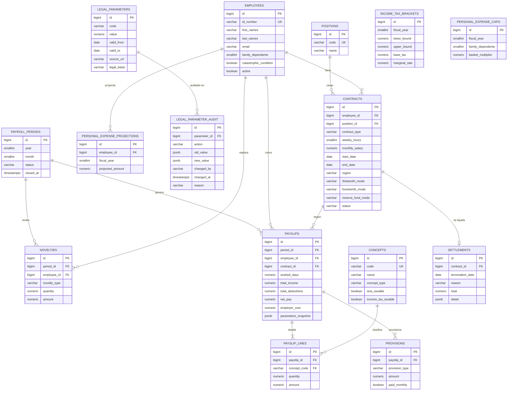

# Modelo de datos — nomina-ec

Derivado de [investigacion.md](investigacion.md). Los códigos `F#` remiten a la tabla de fuentes.
Motor: PostgreSQL 16 · migraciones Flyway en `backend/src/main/resources/db/migration`.
Montos: `numeric(12,2)`; tasas: `numeric(10,6)`; redondeo en la aplicación con `BigDecimal` y `RoundingMode.HALF_UP`.

## Tablas, restricciones y reglas

| Tabla | Campo | Tipo | Restricción | Regla / fuente |
|---|---|---|---|---|
| employees | id_number | varchar(10) | UNIQUE, cédula con dígito verificador módulo 10 (validado en DTO) | Datos de demo ficticios; LOPDP: la API la devuelve enmascarada (`17******25`) |
| employees | family_dependents | smallint | 0–20 | Cargas para el límite de gastos personales (F9) |
| employees | catastrophic_condition | boolean | default false | Límite de 100 canastas (F10) |
| positions | code | varchar(20) | UNIQUE | Catálogo interno |
| contracts | contract_type | varchar(20) | CHECK IN (INDEFINITE, EVENTUAL, OCCASIONAL, SEASONAL, PER_PROJECT) | Modalidades vigentes tras la reforma de 2015 (F3) |
| contracts | weekly_hours | smallint | CHECK 1–40 | Art. 47 (F3) |
| contracts | monthly_salary | numeric(12,2) | CHECK > 0; ≥ SBU proporcional (validado en servicio porque el SBU cambia por fecha) | Art. 117 / F1 |
| contracts | region | varchar(20) | CHECK IN (COSTA_GALAPAGOS, SIERRA_AMAZONIA) | Ciclo del décimo cuarto, Art. 113 |
| contracts | thirteenth_mode, fourteenth_mode | varchar(12) | CHECK IN (MONTHLY, ACCUMULATED), default MONTHLY | Arts. 111 y 113: mensual por defecto, acumulado a pedido escrito |
| contracts | reserve_fund_mode | varchar(12) | CHECK IN (MONTHLY, ACCUMULATED), default MONTHLY | F4 |
| contracts | (employee_id) | — | índice único parcial `WHERE status = 'ACTIVE'` | Un solo contrato activo por empleado |
| concepts | concept_type | varchar(25) | CHECK IN (INCOME, DEDUCTION, PROVISION, EMPLOYER_CONTRIBUTION) | Clasificación contable del rol |
| concepts | iess_taxable, income_tax_taxable | boolean | NOT NULL | Arts. 95, 112 (F3); LRTI Art. 9 (F12) |
| legal_parameters | (code, valid_from, valid_to) | — | `EXCLUDE USING gist (code WITH =, daterange(valid_from, valid_to, '[]') WITH &&)` | Sin solapamiento de vigencias: para cada fecha hay un único valor |
| legal_parameters | source_url | varchar(500) | NOT NULL | Trazabilidad exigida por el proyecto |
| legal_parameter_audit | — | — | Solo INSERT desde la aplicación | Auditoría de cambios (quién, cuándo, antes/después, motivo) |
| income_tax_brackets | (fiscal_year, lower_bound) | — | UNIQUE; `upper_bound` NULL = "en adelante" | F6 |
| personal_expense_caps | (fiscal_year, family_dependents) | — | UNIQUE; 5 = "5 o más" | F9 |
| personal_expense_projections | (employee_id, fiscal_year) | — | UNIQUE; amount ≥ 0 | Formulario de proyección entregado por el trabajador (F8) |
| payroll_periods | (year, month) | — | UNIQUE; status CHECK IN (OPEN, CALCULATED, CLOSED) | Un periodo cerrado es inmutable |
| novelties | novelty_type | varchar(30) | CHECK IN (OVERTIME_SUPPLEMENTARY, OVERTIME_EXTRAORDINARY, ABSENCE_DAYS, ADVANCE, BONUS, OTHER_DEDUCTION) | Art. 55 (F3) |
| novelties | quantity / amount | numeric | horas/días en `quantity`, dinero en `amount`; ≥ 0 | — |
| payslips | (period_id, employee_id) | — | UNIQUE | Un rol por empleado y periodo |
| payslips | parameters_snapshot | jsonb | NOT NULL | Valores legales usados → rol reproducible y auditable |
| provisions | provision_type | varchar(20) | CHECK IN (THIRTEENTH, FOURTEENTH, RESERVE_FUND, VACATION) | `paid_monthly = true` si se pagó en el rol |
| settlements | reason | varchar(30) | CHECK IN (RESIGNATION, MUTUAL_AGREEMENT, UNJUSTIFIED_DISMISSAL, JUSTIFIED_DISMISSAL) | Arts. 185 y 188 (F3) |
| app_users | role | varchar(20) | CHECK IN (ADMIN, PAYROLL, VIEWER) | Contraseñas BCrypt |

## Reglas de negocio clave

1. **Resolución de parámetros por fecha**: cada cálculo pide `valor(código, fecha)` con fecha = último día del periodo. Cambiar un parámetro es un `INSERT` con nueva vigencia (sin recompilar).
2. **Protección de periodos cerrados**: no se admite una nueva vigencia que empiece dentro de un periodo `CLOSED` ni recalcular un periodo cerrado.
3. **Reproducibilidad**: recalcular un periodo abierto con las mismas novedades produce exactamente los mismos montos; el snapshot JSON guarda cada valor usado.
4. **Auditoría**: toda creación o cierre de vigencia escribe en `legal_parameter_audit` con usuario autenticado y motivo obligatorio.

## Catálogo de conceptos (seed)

| Código | Tipo | IESS | IR | Nota |
|---|---|:-:|:-:|---|
| SALARY | INCOME | ✔ | ✔ | Sueldo proporcional a días trabajados |
| OVERTIME_SUPPLEMENTARY | INCOME | ✔ | ✔ | +50 % |
| OVERTIME_EXTRAORDINARY | INCOME | ✔ | ✔ | +100 % |
| BONUS | INCOME | ✔ | ✔ | Otros ingresos gravados |
| THIRTEENTH_MONTHLY | INCOME | ✘ | ✘ | Décimo tercero mensualizado |
| FOURTEENTH_MONTHLY | INCOME | ✘ | ✘ | Décimo cuarto mensualizado |
| RESERVE_FUND_MONTHLY | INCOME | ✘ | ✘ | Fondo de reserva mensualizado |
| IESS_PERSONAL | DEDUCTION | — | — | 9,45 % |
| INCOME_TAX | DEDUCTION | — | — | Retención IR |
| ADVANCE | DEDUCTION | — | — | Anticipo |
| OTHER_DEDUCTION | DEDUCTION | — | — | Otros descuentos |
| PROV_THIRTEENTH / PROV_FOURTEENTH / PROV_RESERVE_FUND / PROV_VACATION | PROVISION | — | — | Provisiones acumuladas |
| IESS_EMPLOYER / IECE / SECAP | EMPLOYER_CONTRIBUTION | — | — | Costo patronal |
